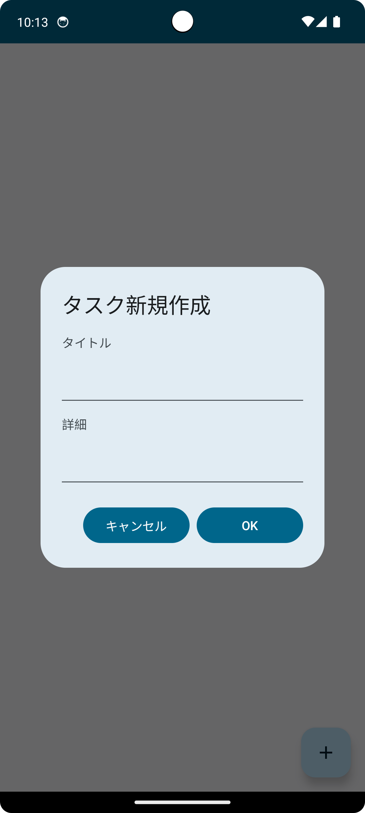
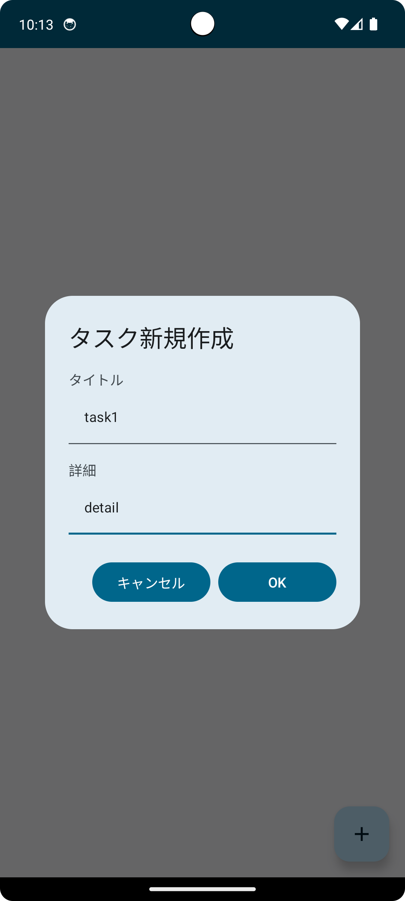
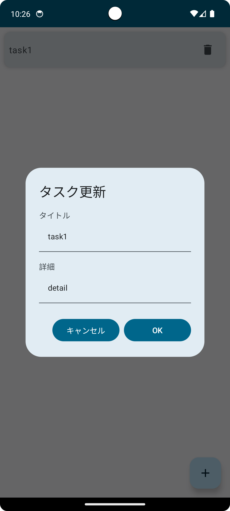

# ToDoApp

- TODOリスト登録アプリ

## 使用技術

## 画面仕様

**画面表示時**

 データなし                      | データあり                      
----------------------------|----------------------------
  |  
 「+」ボタンタップでダイアログを表示する | アイテムタップでダイアログを更新状態で表示する 削除ボタンタップでアイテムを削除する

---

**ダイアログ**

 表示時                        | 入力時                           
----------------------------|-------------------------------
  |  
 キャンセルボタンタップでダイアログを閉じる 登録ボタンタップでタスクを登録する | タスクタイトルと詳細を入力する

---

**更新時**

- 登録済みのリストアイテムタップされた場合は編集可能
- ダイアログに登録したタイトルと詳細を表示する

更新時

