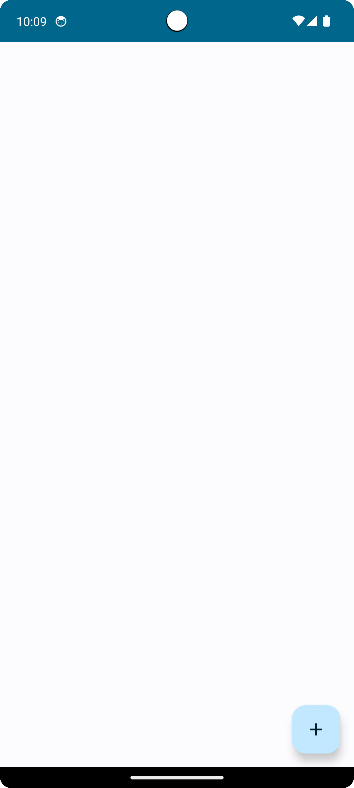
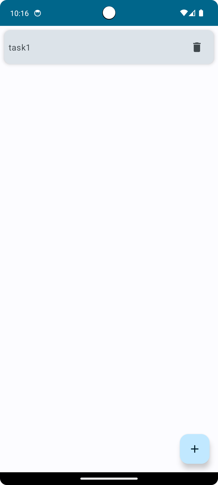

# ToDoApp

- TODOリスト登録アプリ

## 画面仕様

**画面表示時**

- データなし
    - 「+」ボタンタップでダイアログを表示する
- データあり
    - アイテムタップでダイアログを編集状態で表示する
    - 削除ボタンタップでアイテムを削除する

 データなし                      | データあり                      
----------------------------|----------------------------
  |  

**ダイアログ**
